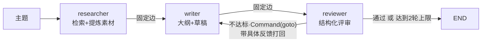

# （三）实战：博客内容团队

> 机制学完了，这一章回到真实需求：**「根据我博客已有的文章，写一篇新文章的大纲与草稿」**。我们组一个三人内容团队（researcher / writer / reviewer），并做一件多数教程不做的事——**用同一任务跑单 Agent 基线做对照实验**，让 token、耗时、质量三组数据来回答「多 Agent 到底值不值」。

## 本章目标

- 综合运用前两章机制搭一个「Pipeline 骨架 + Evaluator 回路」的混合架构
- 实现生产形态的评审回路：结构化评审 + 打回上限 + 反馈驱动重写
- 学会用对照实验评估架构决策（而不是凭感觉「多 Agent 一定更好」）

## 一、团队架构



一个值得学的混搭原则：**确定性的流程用固定边，决策点才用 `Command`**。researcher → writer → reviewer 的顺序永远不变（固定边）；只有 reviewer 的「打回还是放行」是真正的运行时决策（Command）。不要为了「显得像多 Agent」把所有边都做成动态的。

### 三个角色的上下文边界

| 角色 | 能看到 | 看不到 | 为什么 |
| --- | --- | --- | --- |
| researcher | 主题 + 检索结果原文 | — | 它的职责就是消化原文 |
| writer | 素材清单 + 评审反馈 | 检索结果原文、检索过程 | 隔离让 writer 的 prompt 极简：「基于素材写作，不要编造」 |
| reviewer | 素材 + 当前稿 | writer 的思考过程 | **评审独立性**：看过草稿心路的评审员会不自觉地「理解」缺陷 |

## 二、评审回路的生产形态

reviewer 用 `with_structured_output(Review)` 输出三个字段：`score`（1-10）、`approved`（≥8 才通过）、`feedback`（不通过时必须给**可执行**的修改意见）。两个工程细节：

1. **打回上限 `MAX_REVIEW_ROUNDS = 2`**——「永不满意」的评审员就是无限互踢的另一种形态：writer 第 3 稿往往不比第 2 稿好，纯烧钱。达到上限直接放行并在轨迹里注明，比死循环体面
2. **反馈必须进重写 prompt**——打回时把「上一稿 + 逐条反馈」一起给 writer；没有反馈的打回等于让模型重新抽卡，质量提升全靠运气

把上限改成 999 再跑一次（作业 2），你会亲眼看到评分在 7/10 附近震荡、token 翻倍——这就是计划里说的「互踢现象」在 Evaluator 回路里的版本。

## 三、对照实验：用数据说话

单 Agent 基线：同样的检索工具、同样的任务、prompt 里也要求「自己检查一遍质量」——它缺的只是**独立的评审视角**和**上下文隔离**。

| 维度 | 单 Agent | 多 Agent 团队 | 解读 |
| --- | --- | --- | --- |
| token 总量 | 1x | 通常 2-4x | 多角色 + 评审回路的固有开销 |
| 耗时 | 1x | 2-3x | 串行协作；可并行的环节才有优化空间 |
| 裁判评分 | 基线 | 评审打回生效时更高更稳 | 提升主要来自 reviewer 的**独立把关**，而非「人多」 |

> 为公平起见，两份产出由**同一个裁判 prompt** 打分（`judge` 函数与 reviewer 同标准）。注意 LLM 裁判自身有方差，严肃对比应像 06 模块那样固定评测集多次取均值——本章演示的是方法论。

实验的真正结论不是「谁赢」，而是：**质量差距 × 你的场景价值 ≥ 成本差距，才值得上多 Agent**——这是（一）章判断三标准的量化版。给自己博客写草稿，单 Agent 可能就够；给客户交付内容，评审回路的稳定性就值回票价。

## 四、准确率提升手段总结（多 Agent 视角）

1. **Evaluator 反馈循环**——本章主角：独立评审 + 可执行反馈 + 上限，是产出质量最直接的杠杆
2. **专业化分工降低单点 prompt 复杂度**——writer 的 prompt 只管「按素材写作」，比单 Agent 的「检索+写作+自查」三合一 prompt 更容易调优、更不容易顾此失彼
3. **上下文隔离防互相干扰**——writer 看不到检索原文（防被无关细节带偏），reviewer 看不到写作过程（保评审独立）
4. **检索质量优先**——researcher 是全队上限：素材错了，writer 写得再好也是错的（错误级联）。07 模块的检索调优在这里同样适用

## 五、动手实践

```bash
cd "09-MultiAgent/（三）实战：博客内容团队/project"
uv sync
uv run python main.py    # 演示1离线；演示2（对照实验）需 LLM_API_KEY
```

| 文件 | 说明 |
| --- | --- |
| `project/corpus.py` | 6 篇模拟文章 + FastEmbed 内存语义检索（researcher 的底座） |
| `project/content_team.py` | **本章核心**：团队图 + 单 Agent 基线 + 公平裁判 |
| `project/main.py` | 检索演示 + 对照实验（轨迹、三维对比表、产出节选） |

## 六、本章的坑与对策

| 坑 | 现象 | 对策 |
| --- | --- | --- |
| 评审员永不满意 | 打回到 recursion limit，token 翻几倍 | 打回上限 + 达上限放行并记录 |
| 打回不带反馈 | 重写质量随机（重新抽卡） | feedback 字段必填且要求「可执行」 |
| 评审标准与裁判标准不一致 | 内部通过、外部低分 | 评审与裁判共用同一套标准描述 |
| researcher 素材错误 | 全队基于错误素材精雕细琢 | 素材里保留来源标题与相关度，可追溯 |
| 为了多而多 | 全动态路由、五六个角色 | 确定性用固定边；角色数从 2-3 个开始 |

## 七、动手作业

1. 给 writer 增加一个「风格」参数（如「面向初学者/面向资深」），观察素材相同、风格不同时评审分数的变化
2. 把 `MAX_REVIEW_ROUNDS` 改成 999，跑一次看「永不满意」的成本曲线，再改回来——亲手踩一次轮数失控的坑
3. 把对照实验换成你的真实博客主题各跑 3 次取平均分，看结论是否稳定（LLM 裁判有方差）
4. 思考题：如果要加第四个角色 `fact_checker`（核对草稿中的数字与命令是否来自素材），它应该插在图的哪个位置？用固定边还是 Command？

## 官方文档与延伸阅读

- [LangGraph：Evaluator-Optimizer 模式](https://docs.langchain.com/oss/python/langgraph/workflows-agents#evaluator-optimizer)
- [Anthropic：How we built our multi-agent research system（多 Agent 成本实测）](https://www.anthropic.com/engineering/built-multi-agent-research-system)
- [LangGraph：Multi-agent 概念](https://docs.langchain.com/oss/python/langgraph/multi-agent)

## 课程到这里

九个模块全部完成：从第一次 API 调用，到 RAG、Agent、LangChain/LangGraph、监控评估、生产部署，再到记忆系统与多 Agent 协作。你的 BlogAgent 已经具备：动态知识库、生产级图内核、可观测、可评估、可部署、记得住回头读者——接下来最好的学习方式，是把它真正接到你的博客上，让真实用户的问题来驱动下一轮迭代。
