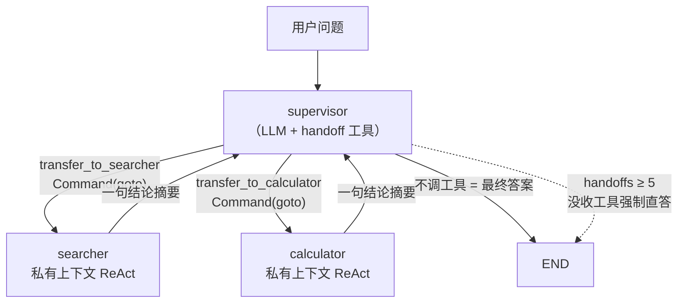

# （二）手写 Supervisor 与 Handoff 机制

> 上一章用规则函数搭出了四种模式的骨架，这一章把规则换成**真 LLM 调度**：supervisor 用 handoff 工具决定「下一步交给谁」，worker 在私有上下文里干活、只回传结论。全程手写——读完你再看 `langgraph-supervisor` 这类框架，一眼就知道它替你封装了什么、出问题时该去哪查。

## 本章目标

- 掌握 `Command(goto=..., update=...)` 路由原语与 handoff 工具的实现
- 弄清多 Agent 最隐蔽的坑：**tool_call 与 ToolMessage 的配对规则**
- 实现三个生产必需机制：防环、摘要化回传、token 成本计量

## 一、整体结构



图里**没有一条固定边**（除了入口）：所有流转都由节点返回的 `Command` 在运行时决定。

## 二、handoff 工具的真相：给 LLM 看的「路由选项」

`transfer_to_searcher` 这类工具的函数体几乎是空的——它的全部价值在**名字、描述和参数 schema**：让 supervisor 的 LLM 能「选择移交目标并写清任务描述」。真正的跳转发生在 supervisor 节点里：

```python
call = response.tool_calls[0]
target = HANDOFF_TARGET[call["name"]]          # 工具名 -> worker 节点名
return Command(goto=target, update={...})       # 跳转 + 更新共享历史
```

工具参数里强制要求 `task`（完整任务描述）是有意的设计：**移交时传「任务」而不是「完整历史」**——worker 拿到的就是这一句话，这正是一章讲的上下文隔离。

> 官方 `langgraph-swarm` 的 handoff 工具用 `Command(graph=Command.PARENT)` 从子图跳回父图——那是「每个 Agent 是独立子图」的架构。本章用平铺图（worker 是普通节点），不需要 `graph=PARENT`，机制更容易看清；理解之后再读官方实现毫无障碍。

## 三、消息配对：最隐蔽的坑

OpenAI 兼容协议规定：**历史里每条 `AIMessage(tool_calls)`，后面必须紧跟与每个 `tool_call_id` 配对的 `ToolMessage`**，否则 API 直接报 400。单 Agent 时框架替你管好了；多 Agent 手工拼接共享历史时，这是头号事故源：

```python
# supervisor 把移交决定写进共享历史时，必须当场补上配对消息
pairing_msgs = [ToolMessage(content=f"已移交给 {target}：{task}",
                            tool_call_id=tc["id"]) for tc in response.tool_calls]
return Command(goto=target, update={"messages": [response, *pairing_msgs], ...})
```

两条铁律：

1. 即使模型一次吐出多个 tool_calls，**每一个**都要有配对的 ToolMessage
2. 裁剪/压缩共享历史时，必须以「AIMessage(tool_calls) + 其全部 ToolMessage」为**原子单位**——剪断配对就是线上 400（03 模块的滑动窗口在多 Agent 里要升级成「配对感知」版）

`main.py` 演示 1 构造了完整的事故现场与修复对照。

## 四、三个生产必需机制

| 机制 | 实现 | 防的是什么 |
| --- | --- | --- |
| **防环** | `handoffs >= MAX_HANDOFFS` 时「没收工具」（bind_tools 不绑了），模型只能基于已有信息直答 | 无限互踢（一章演示 3 的真 LLM 版） |
| **摘要化回传** | worker 的 ReAct 私有上下文用完即弃，只把最后一句结论以 `[searcher 回报] …` 写回共享历史 | 成本爆炸——supervisor 每次决策都要重读共享历史，垃圾进历史是**全队反复付费** |
| **成本计量** | 每次 LLM 调用读 `usage_metadata`，按 Agent 记账 | 责任不清——成本表能直接看出哪个 Agent 在烧钱 |

防环的「没收工具」值得一提：比起在 prompt 里写「请不要再移交了」（模型可能不听），**从 schema 层面拿走工具**是硬约束，这是 03 模块「工具安全」思想在多 Agent 里的延续。

## 五、动手实践

```bash
cd "09-MultiAgent/（二）手写Supervisor与Handoff/project"
uv sync
uv run python main.py    # 两个演示都需要 LLM_API_KEY（真 LLM 调度）
```

跑通后你会看到：复合问题「有几篇 Docker 文章？占比多少？」被拆成两次移交（searcher 查数量 → calculator 算占比），最后 supervisor 汇总作答；成本表里 supervisor 的输入 token 明显最高——**中心调度的代价是肉眼可见的**。

| 文件 | 说明 |
| --- | --- |
| `project/team.py` | **本章核心**：supervisor / worker / handoff / 防环 / 计量全部在此 |
| `project/main.py` | 演示 1 配对事故现场；演示 2 团队协作 + 成本表 |

## 六、框架 vs 手写对照

| 你手写的 | `langgraph-supervisor` / `langgraph-swarm` 替你做的 |
| --- | --- |
| handoff 工具 + HANDOFF_TARGET 映射 | `create_handoff_tool(agent_name=...)` 自动生成 |
| supervisor 节点的路由逻辑 | `create_supervisor(agents=[...], model=...)` 一行搭好 |
| 消息配对的 ToolMessage | 框架内部自动补 |
| worker 上下文隔离 | swarm：每个 Agent 是独立子图，`Command(graph=PARENT)` 跳回 |
| 防环 / 成本计量 | **框架不管**——上限、兜底、记账仍然要你自己做 |

结论与 05 模块一致：框架省的是样板代码，**省不掉的是设计判断**（移交粒度、上下文边界、防环策略）。

## 七、本章的坑与对策

| 坑 | 现象 | 对策 |
| --- | --- | --- |
| 配对被剪断 | 第二轮对话直接 400 | 配对原子单位裁剪；拼历史当场补 ToolMessage |
| worker 全文回传 | supervisor 输入 token 暴涨 | 摘要化回传，过程不出 worker |
| 防环只写在 prompt 里 | 模型偶尔不听，照样互踢 | schema 层面没收工具（硬约束） |
| supervisor 重复移交同一任务 | 多花一倍钱得到同样结论 | prompt 写明「回报已在对话里」+ 轨迹里盯 `handoffs` 数 |
| 复合问题一次移交搞定不了就放弃 | 答案缺一半 | supervisor prompt 强调「一次只移交一个任务」，靠多轮凑齐 |

## 八、动手作业

1. 加一个第三 worker：`translator`（中英互译，不需要工具），观察 supervisor 能否正确地三选一
2. 把 `MAX_HANDOFFS` 改成 1，问同样的复合问题——看兜底直答的答案质量如何劣化，体会「防环上限」的取舍
3. 把 worker 回传改成全量私有上下文（去掉摘要化），对比成本表的变化
4. 思考题：现在 supervisor 是「串行」分派的；如果两个子任务互不依赖（查 Docker 文章数、查 Python 文章数），怎么改成并行？（提示：`Command` 支持 `goto=["a", "b"]`）

## 官方文档与延伸阅读

- [LangGraph：Command 与动态路由](https://docs.langchain.com/oss/python/langgraph/graph-api#command)
- [LangGraph：Multi-agent（handoff 模式）](https://docs.langchain.com/oss/python/langgraph/multi-agent)
- [langgraph-supervisor（prebuilt）](https://github.com/langchain-ai/langgraph-supervisor-py)
- [langgraph-swarm（prebuilt）](https://github.com/langchain-ai/langgraph-swarm-py)

## 下一章预告

机制都齐了，最后一章上**真实任务**：researcher + writer + reviewer 组成博客内容团队，根据你已有的文章写新文章大纲与草稿；并用同一任务跑「单 Agent vs 多 Agent」对照实验——用 token、耗时、质量三组数据回答「多 Agent 到底值不值」。
