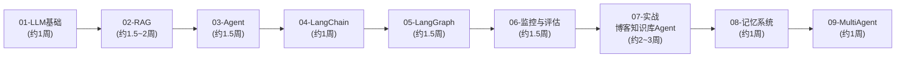
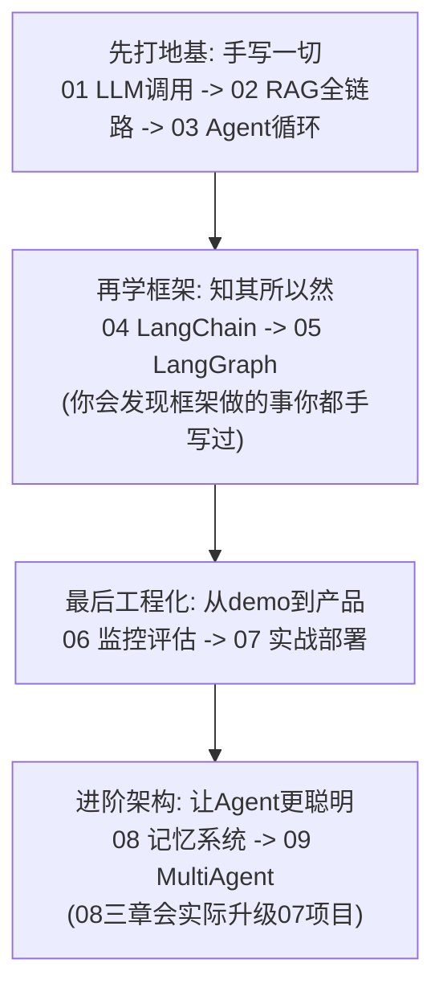
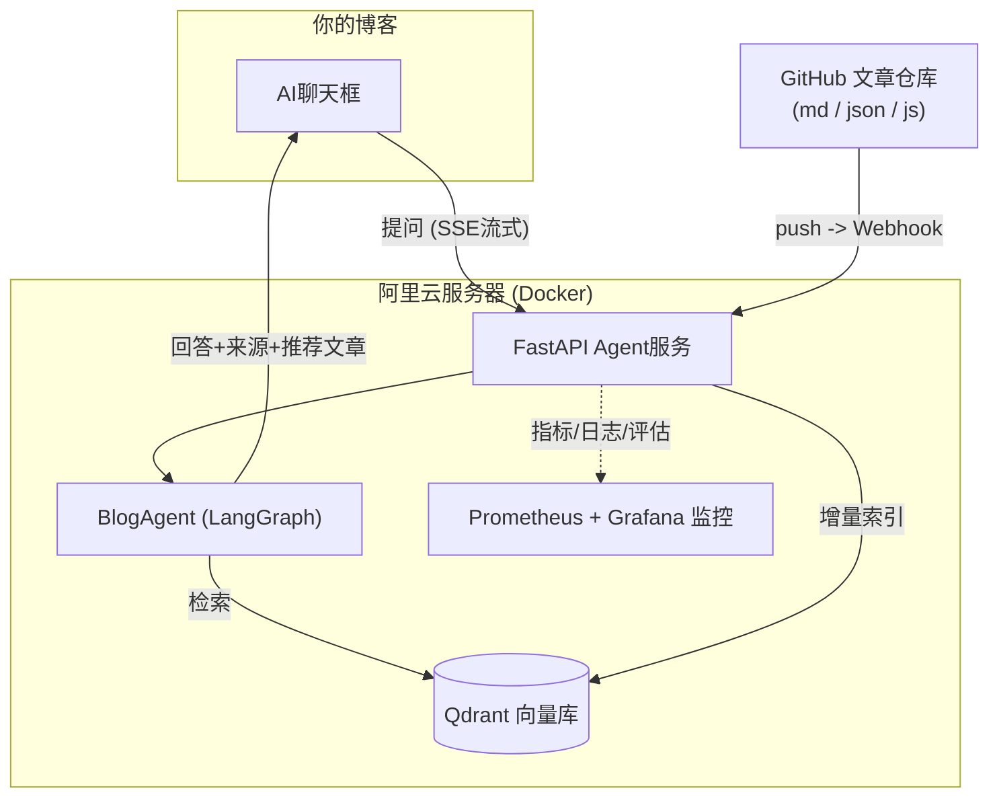
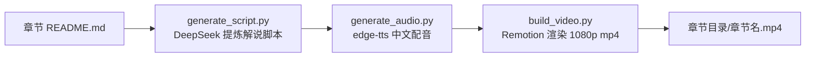

# learnAgent —— AI Agent 开发系统学习路线

> 一套为「资深前端工程师 + 会 Python」量身定制的 Agent 开发课程。
> 不堆砌框架、不抄 demo，从第一性原理出发，最终落地一个**生产级的个人博客知识库 Agent**：
> 自动同步 GitHub 文章仓库 → 动态 RAG 知识库 → 博客聊天框智能问答 + 文章推荐 → 监控与评估体系。

## 一、学习路线总览



### 设计理念：为什么是这个顺序？



1. **先手写后框架**：直接学 LangChain/LangGraph 只会「调 API」，手写过 RAG 和 Agent 循环之后再学框架，每个抽象都能对应到你写过的代码
2. **RAG 优先于 Agent**：你的博客项目第一核心是 RAG 质量，Agent 是锦上添花
3. **监控评估不是附属品**：没有评估集和指标，连「这次改动是变好还是变坏」都说不清
4. **一切围绕实战项目**：每个模块的例子都贴着「博客知识库 Agent」的场景设计，学完即用

### 模块一览与状态

| 模块 | 内容 | 章节数 | 状态 |
| --- | --- | --- | --- |
| [01-LLM基础](./01-LLM基础/README.md) | API调用 / Prompt / 结构化输出 / 工具调用 / 流式与多轮 / 生态名词地图(MCP·Skill·Harness) | 6 | ✅ 已生成 |
| [02-RAG](./02-RAG/README.md) | Embedding / 切片 / Qdrant / 完整RAG / 检索调优 | 5 | ✅ 已生成 |
| [03-Agent](./03-Agent/README.md) | Workflow vs Agent / ReAct / 工具设计 / 记忆 / BlogAgent雏形 | 5 | ✅ 已生成 |
| [04-LangChain](./04-LangChain/README.md) | 模型接入与Runnable / 模板与结构化输出 / LangChain版RAG / create_agent | 4 | ✅ 已生成 |
| [05-LangGraph](./05-LangGraph/README.md) | StateGraph / 条件路由与循环 / 图化RAG / Agent图 / 持久化与HITL | 5 | ✅ 已生成 |
| [06-监控与评估](./06-监控与评估/README.md) | 日志与qa_logs / OTel+Jaeger / Prometheus+Grafana / Ragas 0.4 / 评估集回归 | 5 | ✅ 已生成 |
| [07-实战-博客知识库Agent](./07-实战-博客知识库Agent/README.md) | GitHub同步 / 动态RAG / FastAPI / LangGraph Agent / 监控评估 / 部署阿里云 | 8 | ✅ 已生成 |
| [08-记忆系统](./08-记忆系统/README.md) | 记忆分层与Store / 抽取整合与遗忘 / 记忆选型（实际升级07项目接入用户长期记忆） | 3 | ✅ 已生成 |
| [09-MultiAgent](./09-MultiAgent/README.md) | 模式选型 / 手写Supervisor与Handoff / 博客内容团队（单/多Agent对照实验） | 3 | ✅ 已生成 |

> 全部 9 个模块（44 章）已生成完毕。07 模块是一个系统的 8 次迭代：从架构设计到部署上线，最后一章的 project 就是可部署到阿里云的完整服务；08 模块第三章在此基础上接入了用户长期记忆（userId 隔离 + 后台抽取 + 召回注入）。

## 二、仓库目录结构

```text
learnAgent/
├── README.md                          # 本文件：总学习路线
├── .env.example                       # 全局环境变量模板（API Key 只需配置一次）
├── .gitattributes                     # Git LFS 规则：mp4/wav 等大文件走 LFS 存储
├── video-studio/                      # 章节教学视频生成流水线（详见第七节）
├── 01-LLM基础/
│   ├── README.md                      # 模块导读：章节地图与学习建议
│   ├── （一）认识LLM与第一次API调用/
│   │   ├── README.md                  # 本章讲解文档（概念 + mermaid图 + 官方资料链接）
│   │   └── project/                   # 本章独立的 Python 项目（可单独打开运行）
│   │       ├── pyproject.toml         # 本章依赖声明（uv 管理）
│   │       ├── uv.lock                # 依赖锁文件（保证环境可复现）
│   │       ├── .python-version        # 固定 Python 3.10
│   │       ├── main.py                # 本章演示入口
│   │       └── llm_client.py          # 本章建立的封装（后续章节复用）
│   ├── （二）Prompt工程基础/{README.md, project/}
│   ├── （三）结构化输出/{README.md, project/}
│   ├── （四）FunctionCalling工具调用/{README.md, project/}
│   ├── （五）流式输出与多轮对话/{README.md, project/}
│   └── （六）名词地图：FunctionCalling、MCP、Skill与Harness/   # 纯文档章
├── 02-RAG/                            # 同样结构：每章 README.md + 独立 project/
├── 03-Agent/                          # （一）为纯概念章节，无 project
├── 04-LangChain/                      # 同样结构，每章含「框架 vs 手写对照」
├── 05-LangGraph/                      # 同样结构，三/四章复用02模块基建
├── 06-监控与评估/                      # 二三章含 docker-compose（Jaeger/Prom/Grafana）
├── 07-实战-博客知识库Agent/             # 一个系统的8次迭代（一章为纯文档）
│   ├── （二）~（七）/project/          # 每章在上一章基础上叠加能力
│   └── （八）部署上线/project/         # Dockerfile + 生产compose + Nginx 配置
├── 08-记忆系统/                        # 长期记忆：Store / 写入维护 / 选型
│   ├── （一）（二）/project/           # 独立项目（离线可跑，LLM 自动降级）
│   └── （三）记忆选型与BlogAgent接入/   # 无独立project：代码改动落在07的六/七/八章
└── 09-MultiAgent/                      # 多Agent：选型 / Supervisor与Handoff / 实战
    └── （一）~（三）/project/          # （一）全离线骨架；（二）（三）真LLM协作
```

### 章节工程约定（重要）

- **每个章节的 `project/` 是完全独立的 Python 项目**：有自己的 `pyproject.toml`、`uv.lock` 和 `.venv`，互不依赖，学到哪章装哪章
- **API Key 全局只配一次**：放在仓库根目录的 `.env`，所有章节代码自动向上查找加载
- **共享代码按需复制**：`llm_client.py`、`embedder.py` 等封装在各章 project 里自带一份，保证每章自包含、可独立运行
- **每章学习姿势**：先读章节 `README.md`（讲解）→ 跑 `project/`（代码全部带详细中文注释）→ 完成章末的动手作业

## 三、环境准备（一次性，约 10 分钟）

### 1. 安装 uv（Python 包管理工具）

本课程用 [uv](https://docs.astral.sh/uv/) 管理 Python 环境和依赖。选择它的理由：

- **快**：Rust 编写，安装依赖比 pip 快 10~100 倍
- **一体化**：集成了 venv（虚拟环境）+ pip（装包）+ pyenv（管理 Python 版本）+ 锁文件，一个工具全搞定
- **PyCharm 原生支持**：PyCharm 2024.3+ 新建/选择解释器时直接支持 uv 类型
- **Agent 生态标配**：LangChain、OpenAI 等主流项目官方文档都已采用 uv

```bash
# macOS 安装（二选一）
curl -LsSf https://astral.sh/uv/install.sh | sh    # 官方脚本（推荐）
brew install uv                                     # 或用 Homebrew

# 验证安装
uv --version
```

### 2. 配置 API Key

```bash
# 在仓库根目录执行
cp .env.example .env
```

然后打开 [DeepSeek 开放平台](https://platform.deepseek.com/api_keys) 注册并创建 API Key（新用户有免费额度，学习花费极低），填入 `.env` 的 `LLM_API_KEY`。

> Embedding 使用本地模型（FastEmbed），免费且无需任何 Key；首次运行 02 模块时会自动下载约 90MB 的模型文件（已配置国内镜像加速）。

### 3. uv 常用命令速查

| 命令 | 作用 | 类比前端 |
| --- | --- | --- |
| `uv sync` | 按 `pyproject.toml`/`uv.lock` 创建 `.venv` 并安装依赖 | `npm install` |
| `uv run python main.py` | 在虚拟环境中运行脚本（无需手动激活环境） | `npx` |
| `uv add requests` | 添加依赖并更新锁文件 | `npm install requests` |
| `uv remove requests` | 移除依赖 | `npm uninstall` |
| `uv python list` | 查看可用的 Python 版本 | `nvm ls` |

### 4. 开始第一章

```bash
cd "01-LLM基础/（一）认识LLM与第一次API调用/project"
uv sync                      # 创建环境并安装依赖（几秒钟）
uv run python llm_client.py  # 环境自检：验证 API Key 配置正确
uv run python main.py        # 运行本章演示
```

## 四、PyCharm 使用指南

每个章节的 `project/` 都是标准 Python 项目，两种打开方式任选：

### 方式 A：打开整个仓库（推荐，方便边看文档边写码）

1. PyCharm 打开 `learnAgent` 根目录
2. 在终端进入要学的章节：`cd "01-LLM基础/（一）认识LLM与第一次API调用/project" && uv sync`
3. 打开该章的任意 `.py` 文件 → 右下角解释器选择 → `Add New Interpreter` → `Select Existing` → 选择该章 `project/.venv/bin/python`
4. 直接点 `main.py` 的绿色运行箭头

### 方式 B：单独打开某一章的 project

1. PyCharm `File → Open` 选择某章的 `project/` 目录
2. PyCharm 2024.3+ 会自动识别 `pyproject.toml` 并提示创建 uv 环境，确认即可（或手动：`Settings → Project → Python Interpreter → Add → uv`）
3. 直接运行 `main.py`

> 提示：运行配置的 Working directory 保持为该章 `project/` 目录（PyCharm 默认如此），数据文件的相对路径才能正确解析。

## 五、实战项目最终形态（学完后你将拥有）



- 用户在博客聊天框提问 → Agent 检索你的文章知识库 → 流式回答 + 标注来源 + 推荐文章链接
- 你 push 新文章到 GitHub → Webhook 自动触发增量索引 → 知识库分钟级更新（动态 RAG）
- Grafana 看板实时展示提问量、延迟、token 成本、检索为空率；评估集自动回归回答质量

## 六、学习守则（来自走过弯路的人的忠告）

1. **不要跳章**：每章代码都建立在前一章之上，跳章 = 知识断层
2. **一定要跑代码、做作业**：看懂 ≠ 会写，每章末尾的动手作业是检验标准
3. **不要囤积框架教程**：CrewAI、AutoGen、Dify……等你完成 07 实战后，再按需了解，半天就能上手任何新框架
4. **遇到报错先自己排查 15 分钟**：读错误信息 → 查官方文档 → 再问 AI，这个习惯比任何课程都值钱
5. **以官方文档为准**：AI 领域迭代极快，本课程所有章节都附了官方文档链接

## 七、章节教学视频生成（video-studio）

每个小节目录下可以生成一支与 README 内容配套的中文教学视频（如 `01-LLM基础/（一）认识LLM与第一次API调用/认识LLM与第一次API调用.mp4`），由 `video-studio/` 流水线自动产出：



### 目录结构

```text
video-studio/
├── package.json / remotion.config.ts  # Remotion v4 工程（需 Node 18+）
├── src/                               # 视频组件：封面/要点/代码/小结 四类场景
├── pipeline/                          # Python 流水线（uv 管理）
│   ├── generate_script.py             # ① README → 解说脚本 scenes.json（调 DeepSeek，无 Key 时离线降级）
│   ├── generate_audio.py              # ② edge-tts 逐场景配音（默认晓晓音色，免费无需 Key）
│   ├── build_video.py                 # ③ Remotion 渲染，mp4 输出到章节目录
│   └── make_video.py                  # 一键流水线（支持 --all 批量生成全部章节）
├── data/                              # 中间产物：各章节 scenes.json（已 gitignore）
└── public/audio/                      # 中间产物：配音 mp3（已 gitignore）
```

### 使用方法

```bash
# 一次性准备
cd video-studio && npm install        # 安装 Remotion
cd pipeline && uv sync                # 安装 Python 依赖

# 生成单个章节（约 3~5 分钟，含 LLM 脚本生成 + 配音 + 渲染）
uv run python make_video.py "../../01-LLM基础/（一）认识LLM与第一次API调用"

# 批量生成全部章节（已有 mp4 的自动跳过；--force 重新生成）
uv run python make_video.py --all

# 在浏览器里实时预览/调试视频画面样式
cd video-studio && npm run studio
```

> 解说脚本默认调用根 `.env` 配置的 DeepSeek 生成口语化讲稿；配音用微软 edge-tts（免费），可通过 `--voice`、`--rate` 调整音色与语速。

### 视频获取（GitHub Release 分发）

全部 44 支教学视频已发布在 Release：**[teaching-videos-v1](https://github.com/yanquankun/learnAgent/releases/tag/teaching-videos-v1)**，文件名与章节目录一一对应，按需下载后放入对应章节目录即可。

> 为什么不放进 git 仓库？视频共约 800MB，已配置 Git LFS（见 `.gitattributes`），但国内网络直连 LFS 的 AWS S3 存储上传/下载极不稳定，而 Release 资产走 GitHub 自有节点、速度稳定，因此选择 Release 分发（`.gitignore` 已忽略 `*.mp4`）。本地生成的视频不受影响，仍输出到各章节目录。

## 协议

[MIT](./LICENSE)
